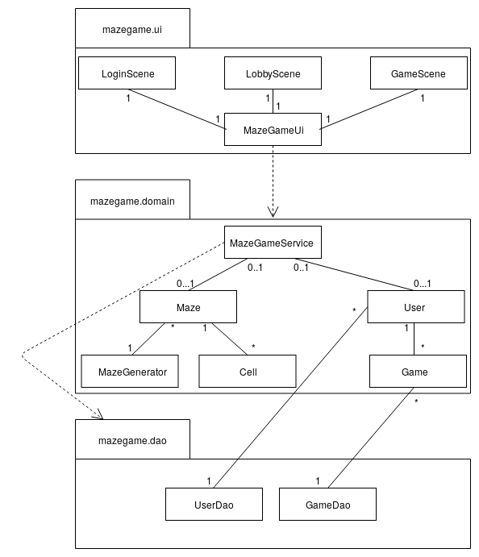
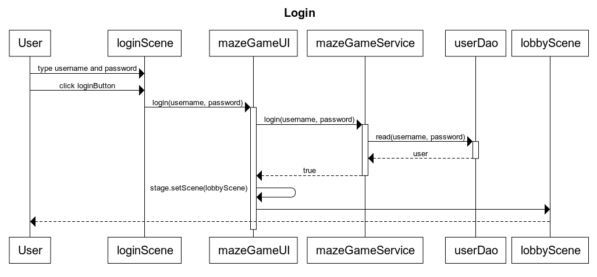

## Rakenne

Ohjelman pakkausrakenne on seuraava:

Pakkaus _ui_ sisältää JavaFX:llä toteutetun käyttöliittymän _domain_ sovelluslogiikan ja _dao_ tietojen pysyväistallennuksesta vastaavan koodin, sekä tietokannan alustavan koodin.

## Käyttöliittmymä

Ohlejmalla on kolme eri näkymää:
- kirjautuminen/uuden käyttäjän luonti
- lobby(pelin avausnäkymä)
- peli

Näkymät on toteuttettu omina luokkinaan. Nämä luokat luovat ja palauttavat Scene-olion, joina näkymät ollaan toteutettu. Vain yksi näistä Scene-olioista on asetettu sovelluksen Stage-olioon, eli vain yksi näkymä näytetään käyttäjälle kerralla. Näkymän vaihtuessa näiden luokkien medodia, joka luo ja palauttaa Stage-olion, kutsutaan uudelleen. Näkymä päivittyy kun siitä siirrytään pois ja sitten takaisin. Käyttöliittymän "pää" luokka _MazeGameUi_ sisältää stagen ja on vastuussa näkymien vaihtamisesta.

Käyttöliittymän koodi ja sovelluslogiikan koodi ollaan pyritty eristämään mahdollisimman paljon. Luokka mazegame.domain.MazeGameService tarjoaa käyttöliittymälle kaikki tarvittavat metodit sovelluslogiikan hoitamiseen esim. hahmon liikuttaminen.

## Kirjautumislogiikkaa

