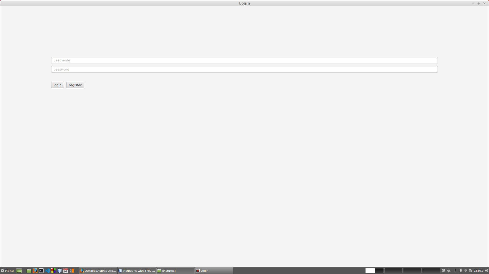
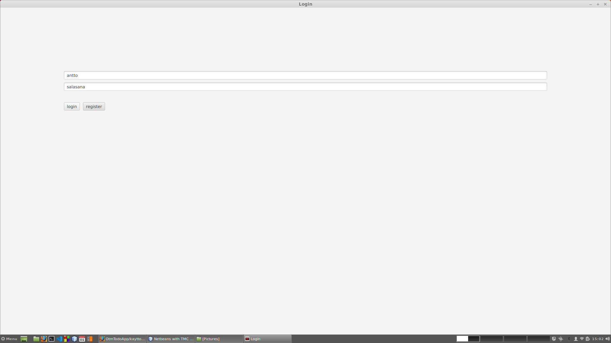
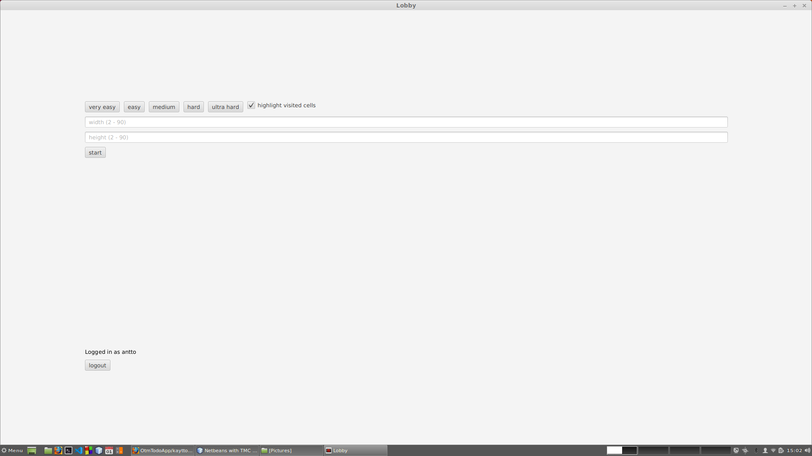
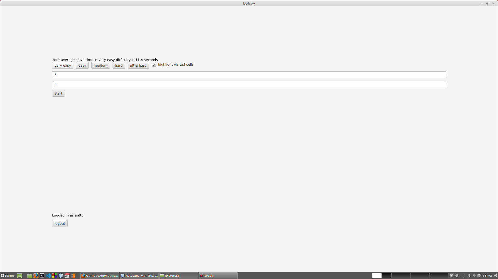
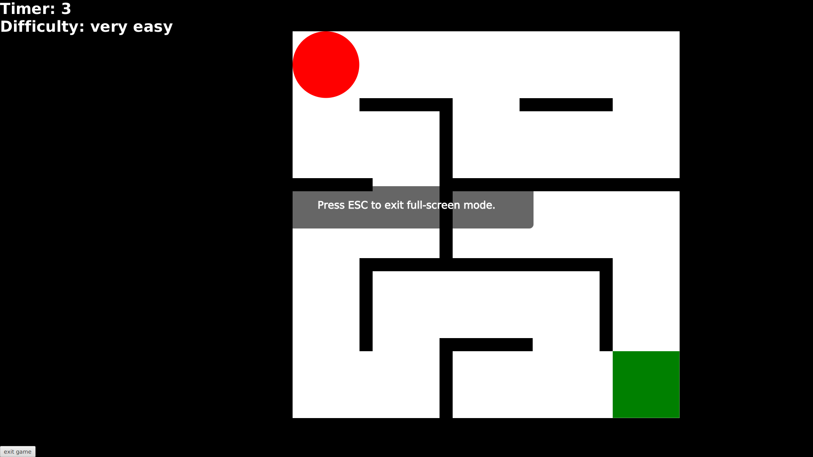
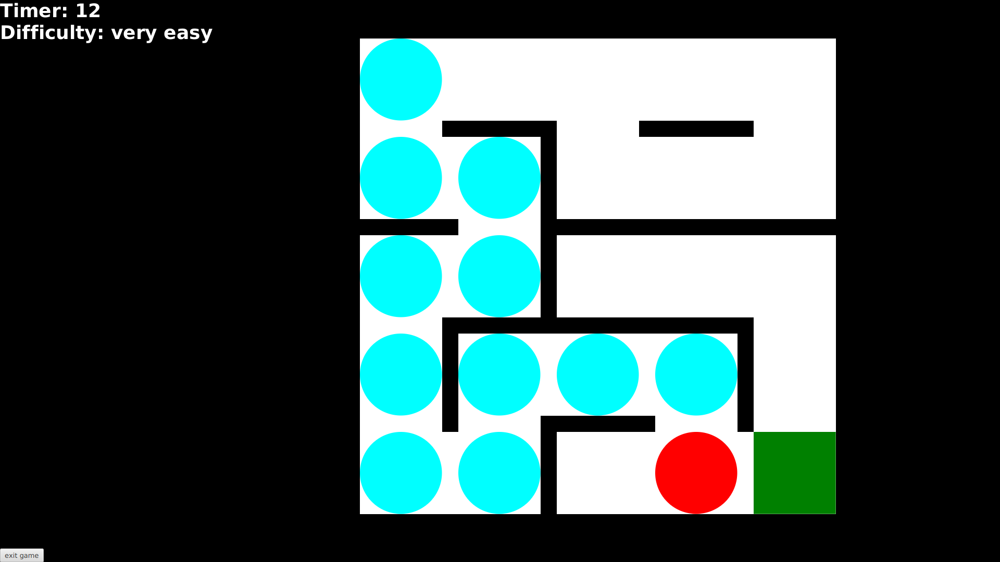
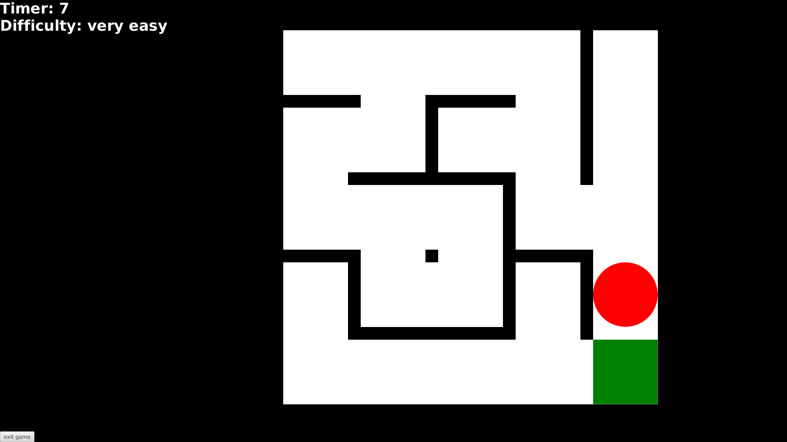

# Käyttöohje

Lataa tiedosto [mazegame.jar](https://github.com/anttoh/ot-harjoitustyo/releases/tag/viikko6)

## Ohjelman käynnistäminen

Ohjelma käynnistetään komennolla 

```
java -jar mazegame.jar
```

## Kirjautuminen ja uuden käyttäjän luonti

Sovellus käynnistyy kirjautumis/rekistöröitymisnäkymään:



Kirjautuminen onnistuu kirjoittamalla olemassaoleva käyttäjätunnus ja sen oikea salasana syötekenttiin ja painamalla _login_.



Uuden käyttäjän luominen onnistuu kirjoittamalla vähintään kolme merkkiä pitkän käyttäjätunnuksen, joka ei ole jo olemassa, sekä sille vähintään viiden merkin pituinen salasana, ja painamalla _register_. Sovellus ilmoittaa, jos käyttäjä tunnus on jo käytössä.


## Pelin konfiguroiminen ja käyttäjän keskiarvojen tutkiminen

Onnistuneen kirjautumisen jälkeen siirrytään lobbyyn eli itse pelin "aulaan":



Pelin vaikeustason voi valita valmiiksi määritellyistä vaihtoehdoista klikkaamalla nappia, jossa lukee toivottu vaikeustaso.



Nappeja klikkaamalla, syötekenttiin width ja height ilmestyy kyseisen vaikeustason sokkelon leveys ja korkeus. Nämä arvot voi myös kirjoittaa kenttiin itse, jolloin pelin vaikeustasoksi määräytyy "custom", ellei itse kirjoitetut leveys ja korkeus satu vastaamaan jonkin valmiiksi määritellyn vaikeustason leveyttä ja korkeutta. Sovellus ilmoittaa, jos annettu leveys tai korkeus on epäkelpo esim. desimaaliluku, kirjain, liian suuri tai pieni luku. Nappeja klikkaamalla, niiden yläpuolelle ilmestyy teksti, joka ilmoittaa käyttäjän, juuri tämän vaikeustason, suoriutumis aikojen keskiarvon. "Custom" peleille ei lasteka keskiarvoa. Valintaruutua klikkaamalla käyttäjä voi valita, korostetaanko käyttäjän kulkema polku sokkelossa. Klikkaamalla nappia _start_ peli käynnistyy, jos leveys ja korkeus ovat sallittuja arvoja.

## Pelin pelaaminen

Sokkelo voisi aluksi näyttää tältä:



Käyttäjän hahmoa (punainen ympyrä) ohjataan näppäimistön nuoli näppäimillä. Hahmo ei voi edetä mustien seinien läpi.

(vieraillut ruudut (siniset ympyrät) näyttävät hahmon kulkeman polun)



(kuljettua polkua ei näytetä, sillä käyttäjä klikkasi valintaruutua)



Tavoitteena on ohjata hahmo maalin (vihreä neliö). Käyttäjä aloittaa aina vasemmasta yläkulmasta ja maali on aina oikeassa alakulmassa. Hahmon siirtyessä maaliruutun ajastin pysähtyy ja käyttäjä siirtyy edelliseen näkymään (lobby). Käyttäjän sokkelon ratkaisu aika lasketaan heti mukaan tämän keskiarvoon tällä vaikeustasolla, jos vaikeustaso oli jokin valmiiksi määritellyistä.
