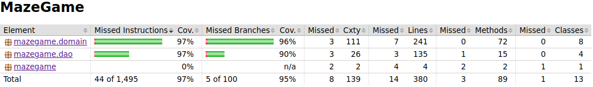

# Testausdokumentti

Sovelluksen logiikkaa ja pysyväistallennusta on testattu automatisoiduin yksikkötestein sekä manuaalisesti graafisen käyttöliittymän avulla. Käyttöliittymää ollaan testattu manuaalisesti käsin. Sovellusta kokonaisuutena on testattu manuaalisesti käsin.

## Yksikkö- ja integraatiotestaus

Jokaiselle sovelluksen luokalle on tehty oma testiluokka, jotka testaavat luokkien jokaista julkista metodia, myös gettereitä ja settereitä, sekä equals ja hashcodea. Luokan MazeGameService testaaminen vastaa integraatiotestausta, sillä luokka on vastuussa sovelluksen kaiken logiikan hallinnasta. Sen metodit käyttävät Daojen metodeja ja muiden logiikka luokkien metodeja. Sen metodien toimimisen edellytyksenä on, että pakkausten mazegame.domain ja mazegame.dao luokat toimivat oikein esim MazeGameServicen register metodin testaamiseksi tulee myös testata, että UserDao create luo uuden käyttäjän. Daoja testatessa käytetään sovelluksen oikeaa tietokantaa, mutta jokainen testeissä luotu käyttäjä (user) ja tulos (result) poistetaan testien lopuksi. Testeissä luotujen käyttäjien käyttäjänimet ovat vaikeasti arvattavissa ja on hyvin epätodennäköistä, että sovelluksen oikea käyttäjä sattuisi valitsemaan jonkin näistä testeissä käytetyistä käyttäjänimistä, joten todennäköisyys että testit eivät toimisi sen takia että käyttäjänimi on varattu (käyttäjänimien tulee olla uniikkeja) on erittäin pieni. Asian voi kuitenkin helposti korjata tarvittaessa, esim luomalla testikäyttäjän jo tietokannan luontihetkellä, jolloin sen valitseminen on mahdotonta käyttäjälle, ja poistamalla sen testien alkaessa ja luomalla sen testien lopuksi.

### Testauskattavuus

Käyttöliittymäkerrosta lukuunottamatta sovelluksen testauksen rivikattavuus on 97% ja haarautumakattavuus 95%

## Järjestelmätestaun

Sovelluksen järjestelmätestaus on tehty manuuaalisesti käsin. Käyttäjän mahdollisia virheellisiä syötteitä on kokeiltu käsin.

## Asennus ja konfigurointi

Sovellus ei vaadi konfigurointia. Sovellus luo tietokannan paikallisesti, jos sitä ei ole ennestään. Sovelluksen toimivuutta on testattu ainoastaan 2019 fuksiläppärillä, jossa on koulun oma Cubbli-linux.

## Toiminnallisuudet

Kaikki vaatimusmäärittelyn listaamat toiminnallisuudet on käyty läpi, ja kokeiltu, että ne toimivat.
